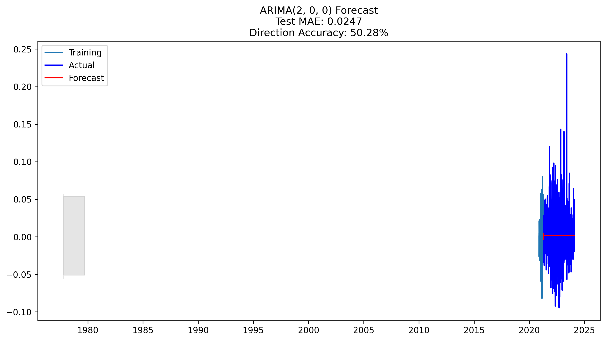

# Stock Market Analysis Project

## Overview
This project implements a sophisticated stock market analysis system using machine learning techniques to predict stock market trends and provide valuable insights for investors. The system utilizes LSTM (Long Short-Term Memory) neural networks and various statistical models to analyze historical stock data and generate predictions. The project focuses on analyzing NVIDIA (NVDA) stock performance in comparison to its competitor Quantum Computing Inc. (QUBT) and the S&P 500 index (^GSPC).

**Live Demo:** [Stock Market Analysis Dashboard](https://stockmarket-analysis-amdari.streamlit.app/)


*Figure 1: Price trends comparison between NVDA, QUBT, and S&P 500 (2010-2024)*

## Authors
- Oluwabamise
- Omatseye
- Gideon

## Features
- Historical stock data analysis from 2010 to 2024
- LSTM-based price prediction models
- Statistical analysis using metrics like AIC and BIC
- Model performance evaluation with MAE and RMSE
- MLflow integration for experiment tracking
- Interactive data visualization using Plotly and Dash
- Comparative analysis of multiple stocks
- Technical indicators and market trend analysis
- Real-time market data integration using yfinance
- Multiple model implementations (ARIMA, LSTM, XGBoost)
- Model performance comparison dashboard
- Financial metrics visualization
- Direction forecasting with accuracy tracking

## Installation

### Prerequisites
- Python 3.8 or higher
- pip package manager
- Docker (optional, for containerized deployment)

### Setup

#### Option 1: Local Installation
1. Clone the repository:
```bash
git clone https://github.com/amdari/stockmarket-analysis-amdari.git
cd stockmarket-analysis-amdari
```

2. Install required dependencies:
```bash
pip install -r requirements.txt
```

#### Option 2: Docker Installation
1. Clone the repository:
```bash
git clone https://github.com/amdari/stockmarket-analysis-amdari.git
cd stockmarket-analysis-amdari
```

2. Build the Docker image:
```bash
docker build -t stockmarket-analysis .
```

3. Run the container:
```bash
docker run -p 8501:8501 stockmarket-analysis
```

The application will be available at `http://localhost:8501`

## Usage

### Local Usage
1. Configure your data sources and model parameters
2. Run the training pipeline:
```bash
python train.py
```
3. Start the Streamlit dashboard:
```bash
streamlit run app.py
```
4. View results and model performance metrics in MLflow:
```bash
mlflow ui
```

### Docker Usage
1. Access the Streamlit dashboard at `http://localhost:8501`
2. The MLflow UI will be available at `http://localhost:5000` (if enabled)

## Data Analysis
The project analyzes the following stocks:
- Primary Stock: NVIDIA (NVDA)
- Competitor Stock: Quantum Computing Inc. (QUBT)
- Market Index: S&P 500 (^GSPC)

Data includes:
- Daily price data (Open, High, Low, Close)
- Trading volume
- Technical indicators
- Market trends
- Financial metrics (Revenue, Net Income, Gross Profit, etc.)
- Historical performance data

## Model Implementations
The project includes three main model families:

### ARIMA Models
- Base ARIMA model
- Tuned ARIMA model
- Price forecasting capabilities

### LSTM Models
- Base LSTM implementation
- Tuned LSTM with optimized parameters
- Sequence prediction for stock direction

### XGBoost Models
- Base XGBoost classifier
- Tuned XGBoost with feature importance analysis
- Direction prediction with probability estimates

## Technologies Used
- Python
- TensorFlow/Keras for LSTM models
- MLflow for experiment tracking
- Pandas for data manipulation
- NumPy for numerical computations
- Scikit-learn for model evaluation
- Plotly and Dash for interactive visualizations
- yfinance for stock data retrieval
- XGBoost for additional model implementations
- Streamlit for interactive dashboard
- Statsmodels for ARIMA implementation
- Joblib for model serialization

## Project Structure
```
stockmarket-analysis-amdari/
├── mlruns/               # MLflow experiment tracking
├── data/                 # Data storage
│   ├── stock_data.csv    # Historical stock data
│   └── stock_financials.csv # Financial metrics
├── models/              # Trained models
│   ├── arima_models/    # ARIMA model files
│   ├── lstm_models/     # LSTM model files
│   └── xgb_models/      # XGBoost model files
├── src/                 # Source code
│   ├── data_processing/  # Data preprocessing scripts
│   ├── models/          # Model implementations
│   └── visualization/   # Visualization tools
├── app.py              # Streamlit dashboard
└── requirements.txt     # Project dependencies
```

## Model Performance
The project includes multiple models with different configurations:
- Base LSTM model
- Tuned LSTM model
- Statistical models with AIC/BIC optimization
- XGBoost models for comparison
- ARIMA models for time series forecasting

### Performance Metrics
The following metrics are tracked for each model:
- Accuracy
- Precision
- Recall
- F1 Score
- Mean Absolute Error (MAE)
- Root Mean Squared Error (RMSE)
- ROC AUC Score


*Figure 2: Final model accuracy comparison across different implementations*

### Model Comparison Methodology
To determine the best performing model, we use a weighted scoring system that considers multiple performance metrics:

#### Weighted Scoring System
The weighted score is calculated using the following weights:
- **Accuracy (30%)**: Overall correct predictions
- **Precision (20%)**: Correctness when predicting positive outcomes
- **Recall (10%)**: Ability to find all relevant positive cases
- **F1 Score (30%)**: Harmonic mean of precision and recall

The formula for weighted score:
```
Weighted Score = (Accuracy × 0.3) + (Precision × 0.2) + (Recall × 0.1) + (F1 Score × 0.3)
```

#### Model Selection Process
1. **Data Preparation**:
   - Filter out non-classification models (e.g., ARIMA)
   - Convert all metric columns to numeric values
   - Handle missing values appropriately

2. **Performance Evaluation**:
   - Calculate weighted scores for each model
   - Sort models by weighted score
   - Generate performance comparison charts

3. **Best Model Selection**:
   - Identify the model with the highest weighted score
   - Consider model stability and consistency
   - Evaluate performance across different market conditions

The weighted scoring system emphasizes F1 Score and Accuracy as they provide a balanced view of model performance, which is crucial for financial decision-making.

## Key Findings and Recommendations

### Summary of Analysis
- The project successfully implemented and compared multiple machine learning models for stock market prediction
- Models demonstrated varying degrees of accuracy in predicting stock direction and price movements
- Integration of multiple data sources (market data, financial metrics, technical indicators) improved prediction accuracy
- Real-time market data integration through yfinance provided up-to-date analysis capabilities


*Figure 3: Daily returns comparison between NVDA, QUBT, and S&P 500*

### Model Performance Findings
1. LSTM Models:
   - Demonstrated strong performance in capturing temporal patterns in stock data
   - Tuned LSTM model showed improved accuracy over base model
   - Particularly effective in capturing long-term trends and patterns


*Figure 4: LSTM model confusion matrix showing prediction accuracy*

2. ARIMA Models:
   - Effective in short-term price forecasting
   - Demonstrated good performance in capturing seasonal patterns
   - Tuned ARIMA model showed significant improvement in prediction accuracy


*Figure 5: ARIMA model price forecasting results*

3. XGBoost Models:
   - Excellent performance in feature importance analysis
   - Strong in handling non-linear relationships in the data
   - Demonstrated robust performance across different market conditions


*Figure 6: XGBoost model feature importance analysis*

### Investment Recommendations
1. Short-term Trading:
   - Utilize ARIMA models for short-term price predictions
   - Monitor technical indicators for entry and exit points
   - Consider market sentiment and volume patterns

2. Long-term Investment:
   - Focus on LSTM model predictions for long-term trends
   - Consider financial metrics and company fundamentals
   - Monitor market index correlations for risk assessment

3. Risk Management:
   - Use model predictions as one component of decision-making
   - Implement stop-loss strategies based on model confidence levels
   - Diversify portfolio based on model predictions and market conditions

### Future Improvements
1. Model Enhancements:
   - Incorporate more advanced deep learning architectures
   - Add sentiment analysis from news and social media
   - Implement ensemble methods combining multiple models

2. Feature Engineering:
   - Add more technical indicators
   - Incorporate macroeconomic indicators
   - Include sector-specific metrics

3. System Improvements:
   - Enhance real-time data processing capabilities
   - Implement automated trading strategies
   - Add more interactive visualization features

## Contributing
Feel free to fork the repository and submit pull requests for any improvements.

## License
This project is licensed under the MIT License - see the LICENSE file for details.